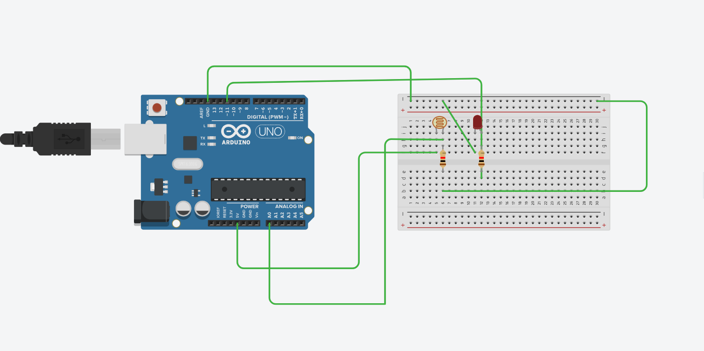

# Automatic Street Light using LDR (Arduino)

##  Project Overview

This project demonstrates a **Basic Automatic Street Light System** using an **LDR (Light Dependent Resistor)** and an **Arduino UNO**. The system automatically turns ON the street light (LED) when it gets dark and turns it OFF when there is sufficient light.

It simulates a real-world smart street lighting system, helping in **energy conservation** and **automation**.

---

##  Components Used

* Arduino UNO
* LDR (Light Dependent Resistor)
* LED
* Resistors (10kΩ for LDR, 220Ω for LED)
* Breadboard
* Jumper Wires

---

## Circuit Description

* The **LDR** is connected in a voltage divider configuration with a resistor.
* The output of the voltage divider is connected to **Analog Pin A0**.
* The **LED** is connected to **Digital Pin 11** through a current-limiting resistor.
* When light intensity changes, the resistance of LDR changes, affecting the voltage at A0.

---

## Circuit Diagram



---

## Arduino Code

```cpp
// Automatic Street Light using LDR

int ldrPin = A0;
int ledPin = 11;

int lightValue = 0;

void setup()
{
  pinMode(ledPin, OUTPUT);
  Serial.begin(9600);
}

void loop()
{
  // Read light intensity
  lightValue = analogRead(ldrPin);

  Serial.print("Light Value: ");
  Serial.println(lightValue);

  // Dark condition
  if (lightValue < 400)
  {
    digitalWrite(ledPin, HIGH);   // Street light ON
  }
  else
  {
    digitalWrite(ledPin, LOW);    // Street light OFF
  }

  delay(500);
}
```

---

## Working Principle

* LDR resistance **decreases in light** and **increases in darkness**.
* Arduino reads analog values (0–1023) from the LDR.
* A threshold value (**400**) is used:

  * **< 400 → Dark → LED ON**
  * **≥ 400 → Bright → LED OFF**

---

## 📊 Serial Monitor Output

You can observe real-time light values in the Serial Monitor:

```
Light Value: 350  → LED ON
Light Value: 600  → LED OFF
```

---

## 🔗 Tinkercad Simulation

👉 Project link here:
`#`


---

## Features

* Automatic light control
* Energy efficient system
* Simple and beginner-friendly IoT project
* Real-world application simulation

---

## Future Improvements

* Add multiple LEDs (street lights array)
* Use a relay to control AC street lights
* Integrate with IoT (ESP8266 / MQTT / Node-RED)
* Add motion sensor (PIR) for smart lighting

---

## Learning Outcomes

* Understanding of LDR and analog sensors
* Arduino analog input handling
* Basic automation logic
* Circuit design on breadboard

---

## License

This project is open-source and free to use for learning purposes.

---

## Author

**Abhishek Kumar**

---

