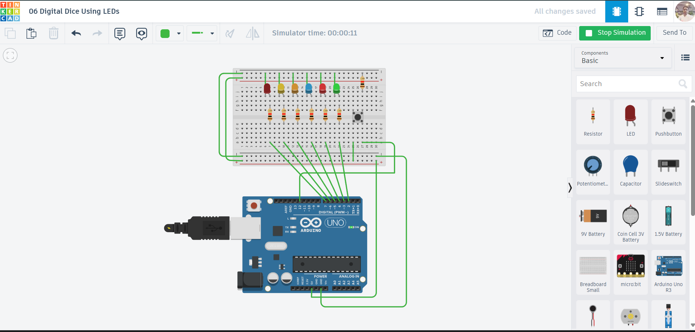

# 🎲 Digital Dice Using LEDs (Arduino)

## Project Overview

This project simulates a **Digital Dice** using **6 LEDs** and a **push button** with an **Arduino UNO**. When the button is pressed, the LEDs animate and then display a random number between **1 to 6**, just like rolling a real dice.

It’s a simple and interactive project that demonstrates **random number generation**, **digital I/O control**, and **user interaction**.

---

## Components Used

* Arduino UNO
* 6 × LEDs
* 6 × Resistors (220Ω recommended)
* Push Button
* Breadboard
* Jumper Wires

---

## Circuit Description

* LEDs are connected to **digital pins 2 to 7**.
* Each LED is connected with a **current-limiting resistor**.
* The push button is connected to **pin 12**.
* Power and ground are distributed using the breadboard rails.

---

## Circuit Diagram



---

## Working Principle

* When the **button is pressed**:

  1. Previous LED states are cleared
  2. A short LED animation runs (build-up effect)
  3. A **random number (1–6)** is generated
  4. LEDs light up according to the generated number

* Representation logic:

  ```
  1 → LED1 ON  
  2 → LED1, LED2 ON  
  ...
  6 → All LEDs ON  
  ```

---

## Features

* Simulates a real dice
* LED animation effect before result
* Random number generation
* Simple and beginner-friendly design

---

## Serial Monitor Output

Displays the generated dice number (for debugging/verification):

```
3
5
1
6
```

---

## Tinkercad Simulation

👉 Add your project link here:
`#`


---

## Future Improvements

* Display dice in real dot pattern (like actual dice face)
* Add buzzer for sound effect
* Use OLED/LCD for better visualization
* Implement button debounce logic
* Add multiple dice support

---

## Learning Outcomes

* Understanding digital output (LED control)
* Handling push button input
* Basics of randomness in embedded systems
* Creating simple LED animations

---

## Code

📁 The Arduino code is available in the repository file:
`code.ino`

---

## License

This project is open-source and free to use for learning purposes.

---

## Author

**Abhishek Kumar**

---

