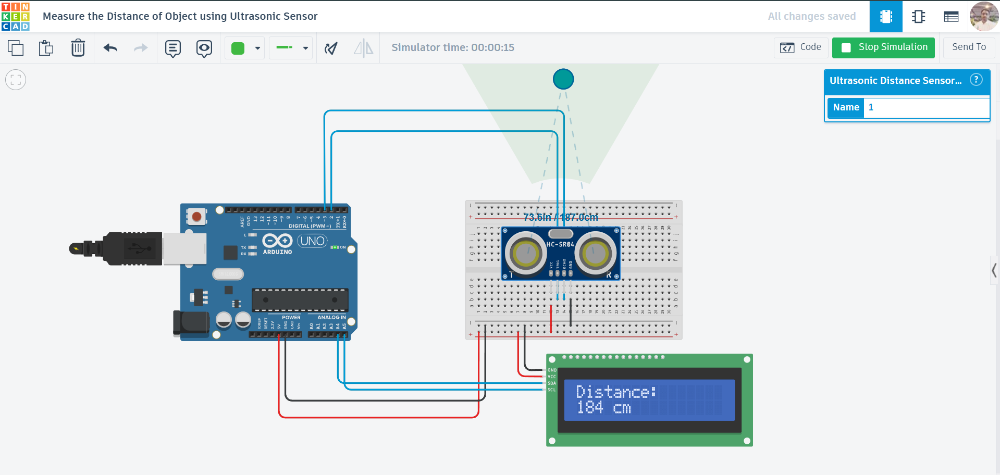

# Measure Distance Using Ultrasonic Sensor (Arduino)

## Project Overview

This project demonstrates how to **measure the distance of an object** using an **Ultrasonic Sensor (HC-SR04)** with an **Arduino UNO** and display the result on an **LCD screen**.

It mimics real-world applications like **parking sensors**, **obstacle detection**, and **robot navigation systems**.

---

## Components Used

* Arduino UNO
* Ultrasonic Sensor (HC-SR04)
* 16×2 LCD Display (I2C / Adafruit LiquidCrystal)
* Breadboard
* Jumper Wires

---

## Circuit Description

* **Ultrasonic Sensor Connections:**

  * VCC → 5V
  * GND → GND
  * TRIG → Digital Pin 2
  * ECHO → Digital Pin 3

* **LCD Connections:**

  * Connected using **I2C / Adafruit LiquidCrystal library**
  * SDA → A4
  * SCL → A5
  * VCC → 5V
  * GND → GND

---

## Circuit Diagram



---

## Working Principle

* The ultrasonic sensor sends a **sound pulse** using the **TRIG pin**.
* The pulse reflects from an object and is received back at the **ECHO pin**.
* Arduino calculates the **time taken** for the echo to return.
* Distance is calculated using the formula:

[
\text{Distance} = \frac{\text{Time} \times 0.034}{2}
]

* The calculated distance is displayed on the **LCD screen in centimeters**.

---

## Output

* The LCD continuously shows:

  ```
  Distance:
  184 cm
  ```

* Values update every **0.5 seconds**.

---

## Tinkercad Simulation

👉 Add your project link here:
`https://www.tinkercad.com/things/91k549PuV9y-measure-the-distance-of-object-using-ultrasonic-sensor-`


---

## Features

* Real-time distance measurement
* LCD display output
* Accurate and fast sensing
* Beginner-friendly hardware setup

---

## Future Improvements

* Add buzzer for proximity alert
* Use LEDs for distance indication (near/far)
* Integrate with IoT dashboard (Node-RED / MQTT)
* Add multiple sensors for 360° detection
* Store data for analysis

---

## Learning Outcomes

* Understanding ultrasonic sensing
* Working with time-based measurements
* Interfacing LCD with Arduino
* Real-world sensor applications

---

## Code

📁 The Arduino code is available in the repository file:
`code.ino`

---

## License

This project is open-source and free to use for learning purposes.

---

## Author

**Abhishek Kumar**

---

