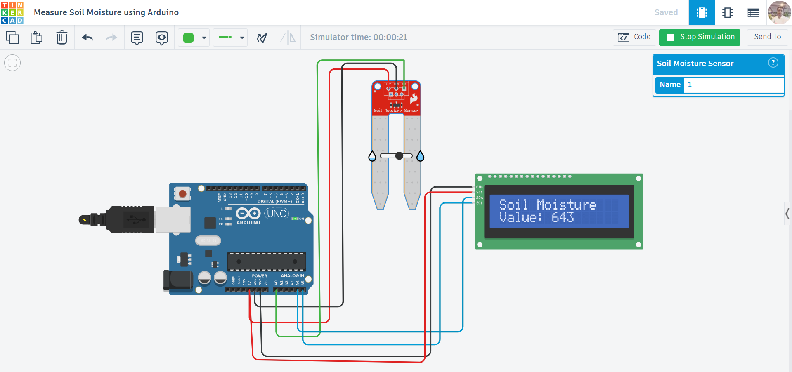

# Soil Moisture Measurement using Arduino

## Project Overview

This project demonstrates how to measure **soil moisture levels** using a **Soil Moisture Sensor** with an **Arduino UNO** and display the readings on an **LCD screen**.

It is a fundamental project for building **smart irrigation systems** and helps in monitoring soil conditions for better plant care.

---

## Components Used

* Arduino UNO
* Soil Moisture Sensor
* 16×2 LCD Display (I2C / Adafruit LiquidCrystal)
* Breadboard
* Jumper Wires

---

## Circuit Description

* **Soil Moisture Sensor:**

  * VCC → 5V
  * GND → GND
  * AO (Analog Output) → A0

* **LCD Display (I2C):**

  * VCC → 5V
  * GND → GND
  * SDA → A4
  * SCL → A5

---

## Circuit Diagram



---

## Working Principle

* The soil moisture sensor measures the **water content in soil** based on electrical conductivity.
* More water → **higher conductivity → higher analog value**
* Less water → **lower conductivity → lower analog value**
* Arduino reads analog values (0–1023) from the sensor and displays them on the LCD.

---

## Output

* The LCD displays real-time soil moisture values:

  ```
  Soil Moisture
  Value: 643
  ```
* Values update every **0.5 seconds**.

---

## Features

* Real-time soil moisture monitoring
* LCD display output
* Simple and efficient design
* Useful for agriculture and IoT projects

---

## Tinkercad Simulation

👉 Project link here:
`https://www.tinkercad.com/things/8Rf5iT1Pxdm-measure-soil-moisture-using-arduino`


---

## Future Improvements

* Convert values into percentage (%)
* Automatic irrigation system (water pump control)
* IoT integration (monitor via mobile/web dashboard)
* Add threshold alerts (LED/Buzzer)
* Data logging for analysis

---

## Learning Outcomes

* Understanding analog sensors
* Reading sensor data using Arduino
* Interfacing LCD with Arduino
* Basics of smart agriculture systems

---

## Code

📁 The Arduino code is available in the repository file:
`code.ino`

---

## License

This project is open-source and free to use for learning purposes.

---

## Author

**Abhishek Kumar**

---
