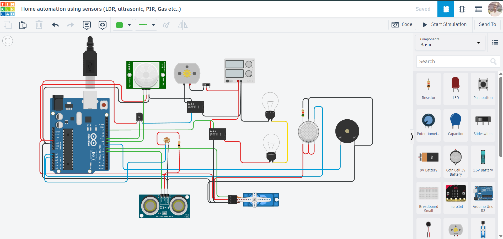

# 🏠 Home Automation System using Multiple Sensors (Arduino)

## 📌 Project Overview

This project is a **Smart Home Automation System** built using an **Arduino UNO** and multiple sensors like **LDR, Ultrasonic Sensor, PIR Motion Sensor, and Gas Sensor**.

It automates various home appliances such as **lights, fan, door, and safety alarms**, making it a compact example of a **real-world IoT-based smart home system**.

---

## Components Used

* Arduino UNO
* LDR (Light Dependent Resistor)
* Ultrasonic Sensor (HC-SR04)
* PIR Motion Sensor
* Gas Sensor
* Servo Motor (for door control)
* Relay Module (for bulb control)
* Buzzer (Piezo)
* NPN Transistor (as switch for fan/light)
* LEDs (Red & Green for status indication)
* Breadboard
* Jumper Wires

---

## Circuit Description

* **LDR (A0):** Controls automatic lighting based on ambient light
* **Gas Sensor (A1):** Detects harmful gases
* **PIR Sensor (D9):** Detects human motion
* **Ultrasonic Sensor (D6):** Measures distance for door automation
* **Servo Motor (D7):** Opens/closes the door
* **Relay (D13):** Controls bulb
* **Buzzer (D8):** Alerts on gas detection
* **NPN Transistor (D10):** Controls fan/light switching
* **LEDs:**

  * Red (D4): No motion
  * Green (D3): Motion detected

---

## Circuit Diagram



---

## Working Principle

### 1. Automatic Light Control (LDR)

* Detects ambient light intensity
* **Dark → Bulb ON**
* **Bright → Bulb OFF**

---

### 2. Motion-Based Control (PIR Sensor)

* Detects human movement
* **Motion Detected:**

  * Fan/Device ON (via transistor)
  * Green LED ON
* **No Motion:**

  * Device OFF
  * Red LED ON

---

### 3. Gas Leakage Detection

* Continuously monitors gas levels
* If gas exceeds threshold:

  * **Buzzer turns ON** (alert system)

---

### 4. Automatic Door System (Ultrasonic + Servo)

* Measures distance using ultrasonic sensor
* **Object detected within range (< 100 cm):**

  * Door opens (Servo rotates to 90°)
* **Otherwise:**

  * Door remains closed (0° position)

---

## Serial Monitor Output

Displays real-time system status:

```
Bulb ON = 350 || Motion Detected! || Gas Sensor Value = 420 || Door Open!
Bulb OFF = 700 || NO Motion Detected || Gas Sensor Value = 200 || Door Closed!
```

---

## Features

* Multi-sensor integration
* Fully automated smart home simulation
* Real-time monitoring via Serial Monitor
* Safety + convenience combined
* Beginner to intermediate level project

---

## Tinkercad Simulation

👉 Add your project link here:
`#`

*(Replace with your actual Tinkercad link)*

---

## Future Improvements

* Add mobile app control (IoT integration using ESP8266/ESP32)
* Voice control (Google Assistant / Alexa)
* Add temperature & humidity monitoring
* Smart energy consumption tracking
* Cloud data logging and analytics

---

## Learning Outcomes

* Working with multiple sensors simultaneously
* Analog and digital signal processing
* Automation logic design
* Interfacing actuators (servo, relay, buzzer)
* Building real-world IoT systems

---

## Code

📁 The Arduino code is available in the repository file:
`code.ino`

---

## License

This project is open-source and free to use for learning purposes.

---

## Author

**Abhishek Kumar**

---

