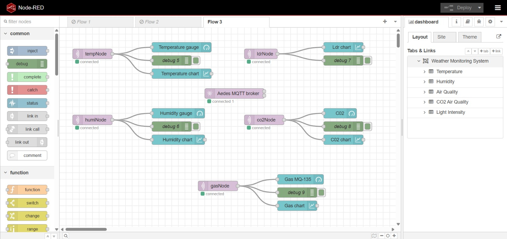
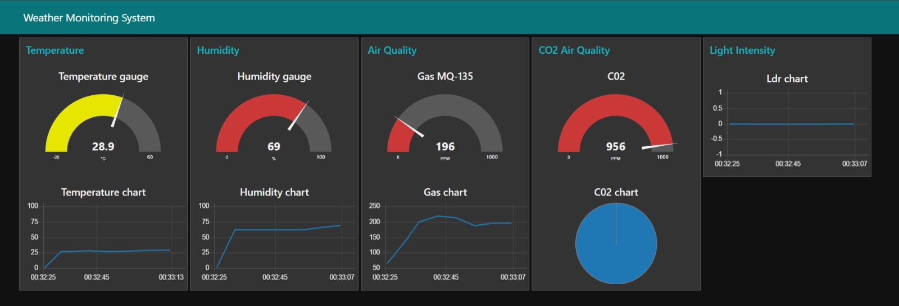

# Real-Time IoT Weather & Environment Monitoring System 🌦️ 

## Project Overview

This project is a **Real-Time IoT Weather & Environment Monitoring System** developed using **NodeMCU (ESP8266)**, multiple environmental sensors, **MQTT protocol**, and a **Node-RED Dashboard**.

The system continuously collects environmental data and visualizes it on a real-time dashboard for monitoring and analysis.

It monitors:

* Temperature
* Humidity
* Air Quality
* CO₂ Levels
* Light Intensity

This project demonstrates the practical implementation of **IoT, real-time communication, and dashboard visualization**.

---

# Technologies & Components Used

## Hardware Components

* NodeMCU (ESP8266)
* DHT11 Sensor (Temperature & Humidity)
* MQ-135 Gas Sensor
* CO₂ Monitoring Sensor
* LDR Sensor
* Breadboard & Jumper Wires

---

## Software & Platforms

* Arduino IDE
* MQTT Protocol
* MQTT Broker (Aedes)
* Node-RED
* Node-RED Dashboard UI

---

# System Architecture

## Data Flow

1. Sensors collect environmental data
2. NodeMCU processes sensor values
3. Data is published using MQTT topics
4. Node-RED subscribes to MQTT data
5. Dashboard visualizes data in real-time

---

# Parameters Monitored

| Parameter       | Sensor Used         | Purpose                   |
| --------------- | ------------------- | ------------------------- |
| Temperature     | DHT11               | Weather monitoring        |
| Humidity        | DHT11               | Moisture level monitoring |
| Air Quality     | MQ-135              | Pollution detection       |
| CO₂ Levels      | MQ-135 / CO₂ Sensor | Air safety monitoring     |
| Light Intensity | LDR                 | Ambient light measurement |

---

# Node-RED Flow

The Node-RED flow processes MQTT sensor data and sends it to dashboard widgets.



---

# Dashboard UI

The dashboard displays real-time sensor values using:

* Gauges
* Charts
* Live Graphs
* Monitoring Panels



---

# Features

* Real-time environmental monitoring
* MQTT-based communication
* Interactive Node-RED dashboard
* Live charts and gauges
* Wireless IoT data transmission
* Multiple sensor integration

---

# 📈 Dashboard Functionalities

## Temperature Monitoring

* Live temperature gauge
* Real-time temperature graph

## Humidity Monitoring

* Humidity gauge and chart visualization

## Air Quality Monitoring

* MQ-135 gas sensor monitoring
* Pollution level visualization

## CO₂ Monitoring

* CO₂ level gauge and chart

## Light Intensity Monitoring

* LDR-based light intensity chart

---

# MQTT Topics Example

```id="rtj2k1"
home/temperature
home/humidity
home/gas
home/co2
home/ldr
```

---

# Future Improvements

* Cloud database integration
* Mobile app monitoring
* Alert system using Telegram/Email/SMS
* Historical data storage and analytics
* AI-based weather prediction
* ESP32 integration for better performance

---

# Learning Outcomes

* IoT architecture understanding
* MQTT communication protocol
* Real-time dashboard creation
* Sensor data acquisition
* Node-RED flow automation
* Data visualization techniques

---

# Code & Flow Files

📁 Project files included in repository:

* `code.ino`
* `nodered-flow.jpeg`
* Dashboard configuration files

---

# License

This project is open-source and intended for educational and learning purposes.

---

# Author

**Abhishek Kumar**

---

