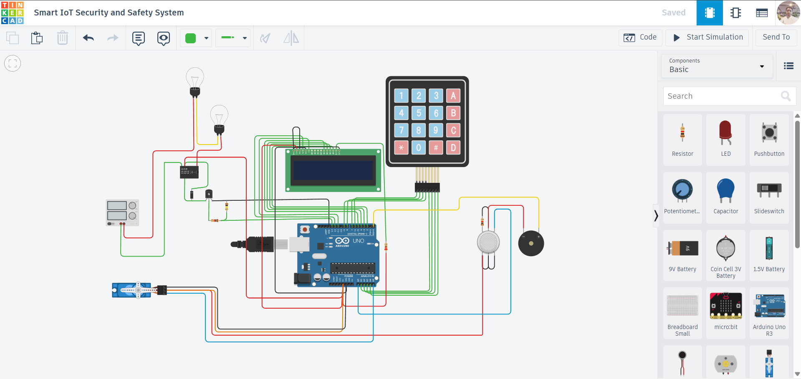

# Smart IoT Security & Safety System (Arduino)

## Project Overview

This project is a **Smart IoT Security and Safety System** built using an **Arduino UNO**, combining **password-based access control**, **gas leakage detection**, and **automatic door control**.

It integrates multiple components like a **keypad, LCD, servo motor, and gas sensor** to create a compact system for **home security and emergency handling**.

---

## Components Used

* Arduino UNO
* 4×4 Keypad
* 16×2 LCD Display
* Servo Motor (for door/gate control)
* Gas Sensor
* Buzzer
* EEPROM (internal Arduino memory)
* Relay / Bulb (optional for indication)
* Breadboard
* Jumper Wires

---

## Circuit Description

* **Keypad:** Used to enter password (connected to digital + analog pins)
* **LCD Display:** Shows system messages (Enter Password, Access Granted, Alerts)
* **Servo Motor (A5):** Controls door lock/unlock
* **Gas Sensor (A0):** Detects gas leakage
* **Buzzer (D0):** Alerts during emergency
* **LED/Relay (D13):** Indicates system state

---

## Circuit Diagram

---

## Working Principle

### 1. Password-Based Door Lock System

* User enters password via keypad
* If correct:

  * LCD shows **Welcome message**
  * Servo opens the door (90°)
* If incorrect:

  * LCD shows **Incorrect Password**

---

### 2. Auto Lock Feature

* After **10 seconds**, the door automatically locks
* Ensures safety even if user forgets

---

### 3. Change Password Feature

* User can set a new password
* Password is stored in **EEPROM** (retains even after power OFF)

---

### 4. Gas Leakage Detection (Safety System)

* Gas sensor continuously monitors environment
* If gas exceeds threshold:

  * LCD displays **FIRE ALERT!**
  * Buzzer turns ON
  * Door automatically opens for emergency exit
  * Warning messages displayed

---

### 5. Smart Delay Activation

* Gas detection starts after **30 seconds** of system startup
* Prevents false alarms during initialization

---

## System Behavior

| Condition        | Action             |
| ---------------- | ------------------ |
| Correct Password | Door Opens         |
| Wrong Password   | Access Denied      |
| No Activity      | Auto Lock          |
| Gas Detected     | Alarm + Door Opens |

---

## Features

* Secure password-based authentication
* Emergency handling system
* Automatic door control
* EEPROM-based password storage
* Multi-functional IoT project

---

## Tinkercad Simulation

👉 Add your project link here:
`#`

*(Replace with your actual Tinkercad link)*

---

## Future Improvements

* Add IoT connectivity (ESP8266 / Blynk / MQTT)
* Mobile app control
* Face recognition / RFID integration
* SMS/Email alert system
* Camera-based surveillance

---

## Learning Outcomes

* Interfacing keypad and LCD
* EEPROM data storage
* Multi-sensor integration
* Real-time safety system design
* Embedded system logic building

---

## Code

📁 The Arduino code is available in the repository file:
`code.ino`

---

## License

This project is open-source and free to use for learning purposes.

---

## Author

**Abhishek Kumar**

---

